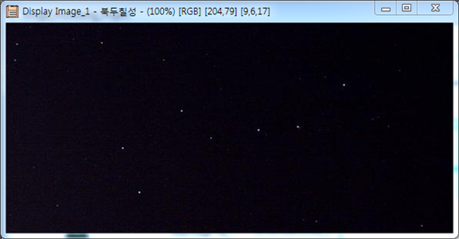
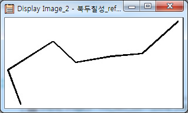
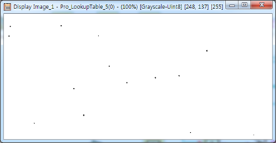
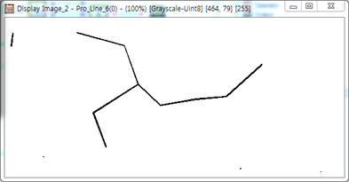
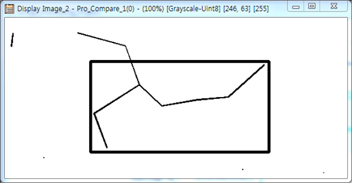
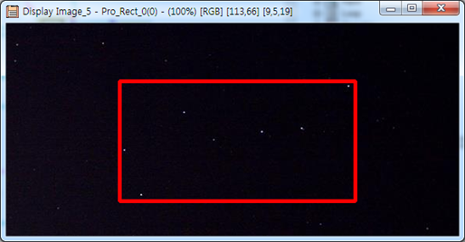

# 별자리 탐색 프로그램

개요
-------------
밤하늘 이미지(input)와 별자리 이미지(reference)를 입력받아 별자리를 찾아 표시(output)합니다.  
별자리 이미지에 Geometric Processing을 적용하여 영상을 확대/축소, 회전할 수 있습니다.  
Open CV의 Template Matching을 통해 입력 영상과 참조영상을 비교합니다.

+ C++
+ MTES
+ 영상처리
+ Geometric Processing
+ Template Matching 

실행 결과
-------------
+ 입력 영상과 참조 영상

  
  

+ 입력 영상에 대해 흑백처리 이후, 화소값 반전

   

+ 일정 거리내 별끼리 선긋기

   

+ 참조 영상과 Template Matching으로 찾은 별자리에 사각형으로 표시

   

+ 원본 영상에 사각형 표시

   

클래스 설계
-------------
+ Pro_Compare.h
<pre><code>
extern "C" __declspec( dllexport )		// DLL 외부에서 호출하기 위해서 필요한 부분
// 탐색 이미지에 대해서 template매칭치 계산, template에 대응하는 좌표에 구형 그리기
int CDECL Pro_Compare(KScScalarImage2dUint8* par0,KScScalarImage2dUint8* par1,KScScalarImage2dUint8* par2,int* par3,int* par4,int* par5,int* par6);
</code></pre>

+ Pro_Line.h
<pre><code>
// DLL 외부에서 호출하기 위해서 필요한 부분 ...
extern "C" __declspec( dllexport )		// DLL 외부에서 호출하기 위해서 필요한 부분
// 별끼리 선을 그어 별자리 창출
int CDECL Pro_Line(KScScalarImage2dUint8* par0,KScScalarImage2dUint8* par1);
</code></pre>

+ Pro_LookupTable.h
<pre><code>
extern "C" __declspec( dllexport )		// DLL 외부에서 호출하기 위해서 필요한 부분
// 영상을 흑백으로 변환
int CDECL Pro_LookupTable(KScScalarImage2dUint8* par0,KScScalarImage2dUint8* par1);
</code></pre>

+ Pro_Rect.h
<pre><code>
extern "C" __declspec( dllexport )		// DLL 외부에서 호출하기 위해서 필요한 부분
// 영상에 사각형 그리기
int CDECL Pro_Rect(int* par0, int* par1, int* par2, int* par3, KScRgbImage2d* par4, KScRgbImage2d* par5);
</code></pre>

+ Pro_Resize.h
<pre><code>
extern "C" __declspec( dllexport )		// DLL 외부에서 호출하기 위해서 필요한 부분
// Geometric Processing
int CDECL Pro_Resize(KScScalarImage2dUint8* par0,KScScalarImage2dUint8* par1);
</code></pre>

+ Pro_ShapeCompare.h
<pre><code>
extern "C" __declspec( dllexport )		// DLL 외부에서 호출하기 위해서 필요한 부분
// Template Matching
int CDECL Pro_ShapeCompare(KScScalarImage2dUint8* par0,KScScalarImage2dUint8* par1,int* par2);
</code></pre>
